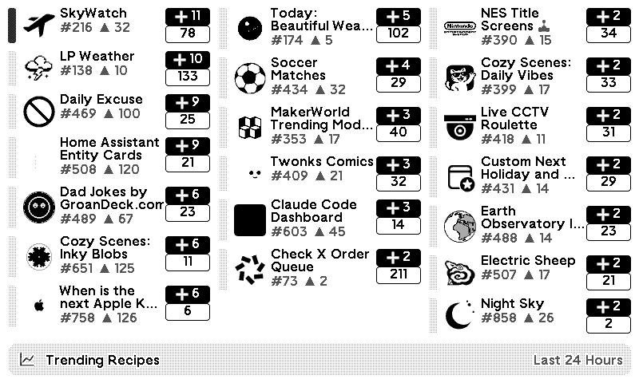

# trmnl-trending-recipes-plugin

<!-- PLUGIN_STATS_START -->
## 🚀 TRMNL Plugin(s)

*Last updated: 2026-02-26 06:57:19 UTC*

##  [Trending Recipes](https://usetrmnl.com/recipes/241645)

 

### Description
See what's trending in the TRMNL recipe community. Tracks recipe installs and forks over time and surfaces the ones gaining momentum.  Supports multiple timeframes, personalized views to highlight your own recipes alongside public trends, and a developer summary showing your global rank and connection stats.  <strong>Updates hourly.</strong>  Styling help by <a href="https://trmnl.com/recipes?user_id=934" target="_blank">L #1385</a>. Icons by <a href="https://www.svgrepo.com/" target="_blank">SVG Repo</a>.

---

<!-- PLUGIN_STATS_END -->
